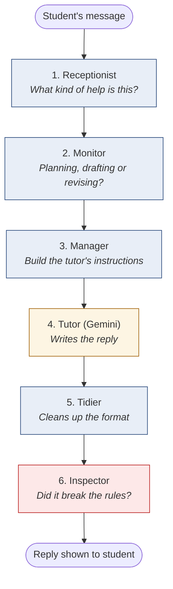
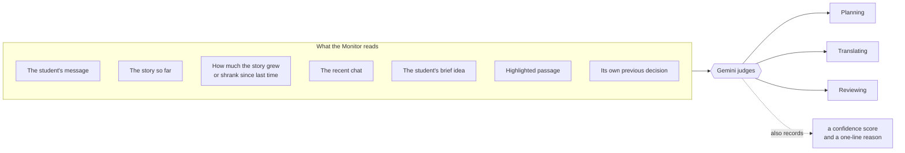
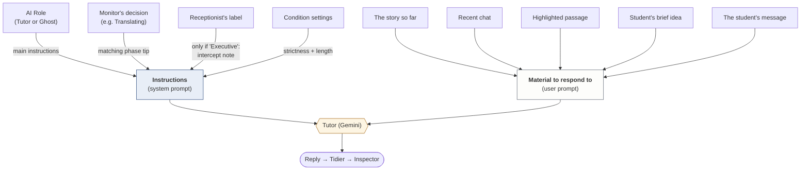
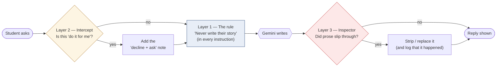
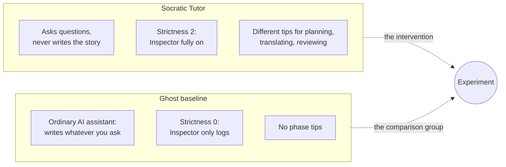
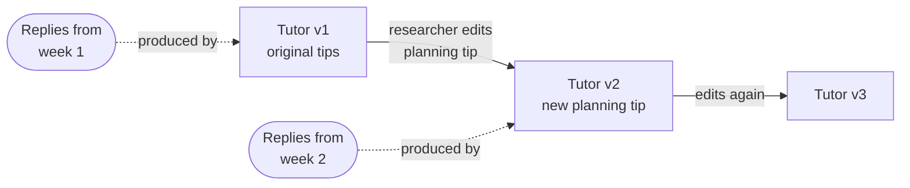
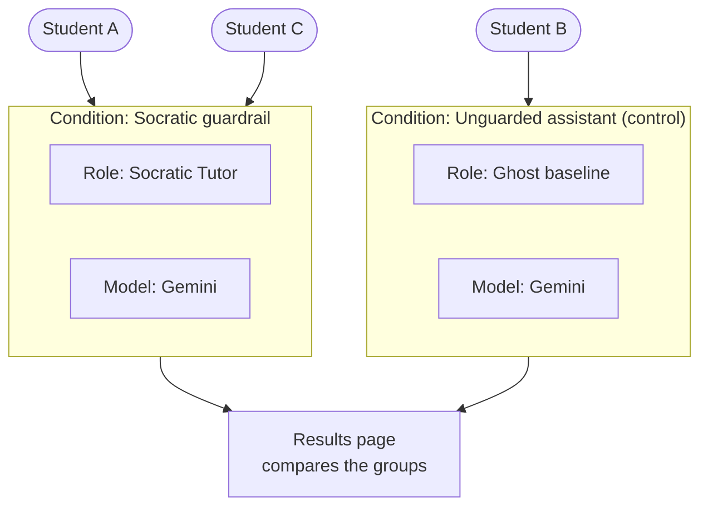
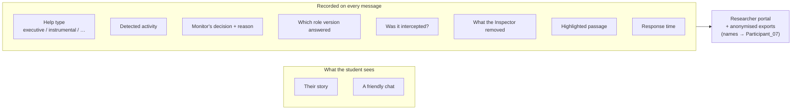

# How Story Studio works — in plain terms

A walkthrough of what happens behind the chat box: the pipeline, the
guardrails, AI roles, the writing-activity Monitor, and what gets recorded.
Written for people who don't read the code. File and function names are in
`code font` for anyone who wants to look.

Throughout, one running example — the student types:

> **"Just write the next paragraph for me."**

---

## 1. The big picture

Think of the AI as a **writing centre with a strict policy**: the tutor helps
you write, but never writes *for* you.

Behind the chat box, every message goes through **six stations**, like an
assembly line. Each station does one job and passes a note to the next.



| # | Station | In the code |
|---|---|---|
| 1 | Receptionist | `intent_classifier` |
| 2 | Monitor | `activity_monitor` |
| 3 | Manager | `role_arbiter` |
| 4 | Tutor | `response_engine` |
| 5 | Tidier | `response_formatter` |
| 6 | Inspector | `agency_enforcer` |

All six live in `backend/app/graph/nodes.py`.

---

## 2. Station by station

### 1 · Receptionist — "What kind of help is this?"

Sorts the request into one of four types (the Helsinki help-seeking model):

| Type | Means | Example |
|---|---|---|
| **Executive** | "Do it for me" | *"Write the next paragraph"* |
| **Instrumental** | "Help me do it myself" | *"How do I build tension?"* |
| **Brainstorm** | "Give me options" | *"What could happen next?"* |
| **Reflection** | Thinking aloud | *"I think she should fail"* |

It first does a quick **keyword check** for blatant cases ("write the…",
"rewrite…", "finish this…"). That also acts as a safety net that works even if
Gemini is down. Then a small, fast Gemini model gives the final label.

**Our example → Executive.**

### 2 · Monitor — "Planning, drafting or revising?"

Flower & Hayes' model of writing has three activities — **Planning**,
**Translating** (turning ideas into sentences) and **Reviewing** — and a
"Monitor" that decides which one the writer is in. Here, **the system is the
Monitor**. Neither the student nor the researcher picks the activity.



It reads the **whole situation**, not just keywords. *"thanks"* means nothing
alone, but after the student just wrote two new paragraphs, it probably means
they're drafting.

There is **no order** — any activity can follow any other, because real
writers jump around.

**Backup plan:** if Gemini can't answer (offline, out of quota), a simple
points-based rule decides instead — e.g. "almost empty page → planning", "text
just grew → translating", "asking about a highlighted passage → reviewing".
That rule is also run silently every time, so researchers can compare it with
Gemini's judgement.

**Our example → probably Translating** ("stuck turning a scene into
sentences").

Code: `backend/app/graph/monitor.py`; the Monitor's instructions are
`MONITOR_SYSTEM_PROMPT` in `backend/app/prompts.py`.

### 3 · Manager — "Build the tutor's instructions"

Stacks together the instructions for *this one reply*, like building a
sandwich (see §3 for the full picture).

### 4 · Tutor — writes the reply

Gemini (`gemini-3.5-flash`) receives the instructions plus the story and writes
a reply. If Gemini fails, a built-in offline tutor answers instead so the app
never breaks.

### 5 · Tidier — cleans up the format

Pulls out the reply and its follow-up questions into a clean shape, even if
Gemini ignored the requested layout.

### 6 · Inspector — the last line of defence

AI models don't always follow instructions (small ones often just start
writing the story). So after the tutor replies, the Inspector checks the
**actual text**:

| Check | What happens |
|---|---|
| Slipped in quoted dialogue? | Stripped |
| "*Here's an example:*" / "*something like…*"? | Cut from that point |
| Narrating the story in past tense, using the student's own character names, asking nothing? | Replaced with *"I started writing the scene there, which isn't mine to write."* |
| A long block of text with no question in it? | Cut to two sentences |

**Our example:** the tutor declined in one line and asked something like
*"What does Idris do with his hands while he decides whether to open it?"* —
nothing to remove.

---

## 3. What the tutor actually receives

The tutor **does not** read notes from the Receptionist or the Monitor
directly. The **Manager turns their decisions into instructions**, and the
tutor only sees those, plus the story.



**The instructions, stacked in order:**

```
┌──────────────────────────────────────────────────────────┐
│ 1. Role's main instructions                               │
│    "You are a Socratic writing partner… you never write   │
│     their story… reply with questions and observations."  │
├──────────────────────────────────────────────────────────┤
│ 2. Phase tip   (from the Monitor)                         │
│    Translating: "name what's jamming the sentence, give   │
│    a method, never the words."                            │
├──────────────────────────────────────────────────────────┤
│ 3. Intercept note   (only if the request was Executive)   │
│    "Decline in one short line, then ask the question      │
│    that lets them write it themselves."                   │
├──────────────────────────────────────────────────────────┤
│ 4. Strictness note   (Tutor at level 2)                   │
│    "Not even illustrative fragments in quotes."           │
├──────────────────────────────────────────────────────────┤
│ 5. Length setting   (light / balanced / deep)             │
└──────────────────────────────────────────────────────────┘
```

**What the tutor never sees:**

- The Receptionist's label itself. Only its "Executive" result gets through
  (as the intercept note); "Instrumental", "Brainstorm" and "Reflection" change
  nothing — they're recorded for research only.
- The Monitor's reason or confidence — only the phase gets through, as the
  matching tip.
- Anything about the experiment — which condition, what's being measured.

---

## 4. Guardrails — three layers, not one

"The guardrail" is really three separate protections at different moments:



| Layer | When it acts | Like… |
|---|---|---|
| **1. The rule in the instructions** | Before Gemini writes | The staff handbook: "never write their story" |
| **2. The intercept** | When a "do it for me" request is spotted | A manager saying "this one's asking for the answer — redirect them" |
| **3. The Inspector** | After Gemini writes | Quality control checking the finished product |

Layer 1 usually works on its own — but AI is unreliable, so layers 2 and 3 are
there for when it doesn't. Every Inspector action is logged, so researchers can
see how often the AI *tried* to break the rule.

---

## 5. AI roles — which job the AI is playing

A **role** is the AI's job description, from Steinhoff & Lehnen's model:
**Ghost** (writes for you), **Partner** (brainstorms with you), **Tutor**
(helps you learn to do it yourself).



| | **Socratic Tutor** | **Ghost baseline** |
|---|---|---|
| Job | Ask questions, never write the story | Write whatever is asked |
| May write prose? | No | Yes |
| Strictness | 2 — Inspector fully on | 0 — Inspector only logs |
| Phase tips | Planning / Translating / Reviewing | None |
| Purpose | The actual intervention | The **control** to compare against |

**Roles are data, not code.** A researcher edits them in the portal
(Researcher → Study → AI roles) — no programmer, no restart.

**Every edit creates a new version** instead of overwriting the old one, and
every reply records which version produced it:



So if Florence changes the planning tip halfway through the study, you can
still tell exactly which replies came from which wording.

---

## 6. Conditions — how the experiment is set up

A **condition** is one arm of the experiment: a bundle of settings.



Students are assigned by hand or at random. The results page then compares
the groups on the same measures:

- **Human agency** — how much of the story is the student's own words
- **AI retention** — how much AI-written text ended up in the story
- **Intercept rate** — how often "do it for me" requests were caught
- words per exchange, draft length, response time

That's the "if we change X, do students do Y?" question.

---

## 7. What the student sees vs what's recorded



The student never sees labels, phases, scores or research settings — only their
story and the conversation.

---

## 8. The whole thing in one sentence

> The student asks something → the system works out **what kind of help** they
> want and **what stage of writing** they're in → builds instructions for the
> AI according to its **role** (Tutor or Ghost) → the AI replies → an
> **Inspector** double-checks it didn't write the story for them → and every
> step is quietly recorded for the research.
